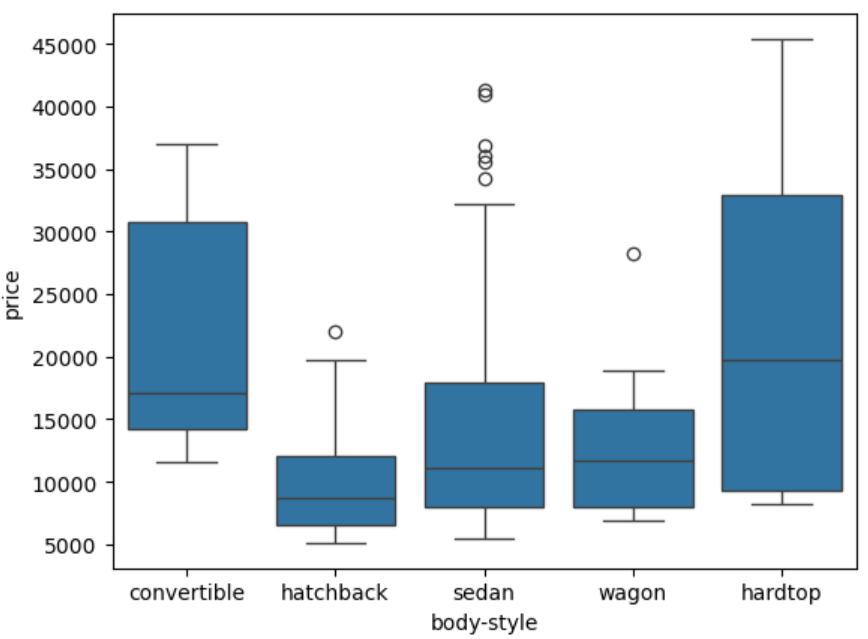
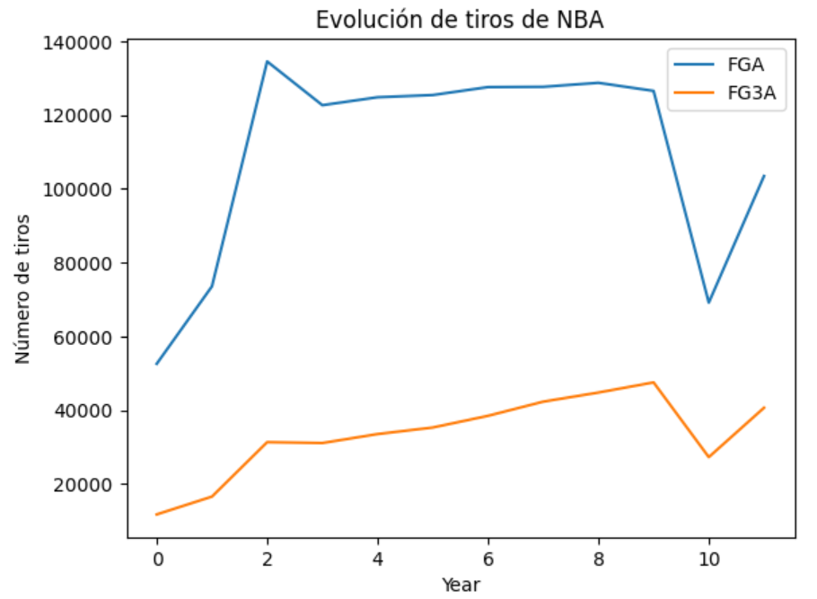

<div align="center">
  <br>
  
  <h1>💻 Data Analysis 💻</h1>
  <strong>School project about csv <a href="https://github.com/lucia-aranda/jupyter/tree/main/ipynb">data analysis</a> using pandas, matplotlib, numpy, seaborn, scipy and piplite libraries.</strong>
</div>

## Summary

| #   | Section                                                                                                                              |
| --- | ---------------------------------------------------------------------------------------------------------------|
| 🚗   | [Car notebook](https://github.com/lucia-aranda/jupyter/blob/main/ipynb/CAR_ANALYSIS.ipynb) + [CSV data file](https://github.com/lucia-aranda/jupyter/blob/main/csv/auto.csv)  |
| 🏀   | [NBA notebook no.1](https://github.com/lucia-aranda/jupyter/blob/main/ipynb/NBA_P1_ANALYSIS.ipynb) + [NBA notebook no.2](https://github.com/lucia-aranda/jupyter/blob/main/ipynb/NBA_P2_ANALYSIS.ipynb) + [CSV data file](https://lucia-aranda.github.io/javascript/)  |
| 📋   | [Reports](https://github.com/lucia-aranda/jupyter/tree/main/pdf)  |

## Prerequisites

To run the project locally, you need a development environment installed on your machine:

- `Python 3.12.x or upper`

- `Jupyter Notebook`

And internet conection 🌐 to propertly load libraries.

## Installation

To run Jupyter Notebook in your personal computer, download <a src="https://www.python.org/">python</a> and run the installer:

- `Add Python to PATH [!important]`

Next, open the command prompt (Windows + R, then type 'cmd') and copy paste:

```
python --version
```

Once you confirm the required version is installed in your computer, install jupyter with:

```
pip install notebook
```

Finally, open the application with the sentence:

```
jupyter notebook
```

Create a new folder, add the files (csv and ipynb) in the same folder and you can now run each line of code from the top to the bottom.

## Concept

This repository storages code that analyzes data from corresponding csv files with Jupyter, using pandas, matplotlib, numpy, seaborn, scipy and piplite libraries. 📈

The analysis focuses on the manipulation and transformation of a dataframe from a CSV file, which generates graphical results in tables. This seeks to generate descriptive statistics, transform the data, and create new dataframes from the columns of the original dataframes, using methods such as .describe() or .to_frame(), for example.
You can use this to read any csv file and easily visualize large data amounts. 🗃️

Whether you're a developer interested in seeing implementations of data analysis, or someone curious about how code can show visual data representation, this portfolio offers hands-on educational examples. 🖥️

## Use case

This small code example from Car Notebook, creates a box graph (boxplot) showing quantitative data according to categories, taking by reference body-style in 'x' and price in 'y'. 
In other words, the relation between cars' body-type and their price.

```
sns.boxplot(x='body-style', y='price', data=df)
```


<br>

This other code example from NBA Notebook, creates a line graph with data obtained from df_line_final, set the title and assign 'y' and 'x' axis label.
The graph basically show NBA strikes per year.

```
df_line_final.plot(kind='line')
plt.title('Evolución de tiros de NBA')
plt.ylabel('Número de tiros')
plt.xlabel('Year')
plt.show()
```



## Contributing

Feel free to DM me 💬 if you have any question(s)/need help/concern(s) about :)
